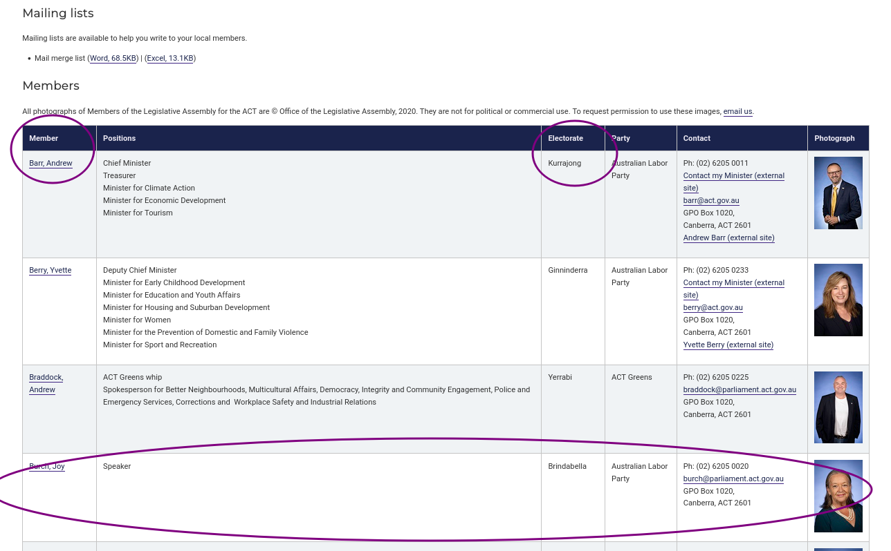

## What is web scraping?

Web scraping is a technique for extracting information from websites. This can be done manually
but it is usually faster, more efficient and less error-prone to automate the task.

Web scraping allows you to acquire non-tabular or poorly structured data from websites and convert it
into a usable, structured format, such as a .csv file or spreadsheet.

Scraping is about more than just acquiring data: it can also help you archive data and track changes to data online.

It is closely related to the practice of
web _indexing_, which is what search engines like Google do when mass-analysing the Web to build
their indices. But contrary to _web indexing_, which typically parses the entire content of a web
page to make it searchable, _web scraping_ targets specific information on the pages visited.

For example, online stores will often scour the publicly available pages of their competitors,
scrape item prices, and then use this information to adjust their own prices. Another common
practice is "contact scraping" in which personal information like email
addresses or phone numbers is collected for marketing purposes.

Web scraping is also increasingly being used by scholars to create data sets for
text mining projects; these might be collections of journal articles or digitised texts. The practice of
[data journalism](https://en.wikipedia.org/wiki/Data_journalism), in particular, relies on the
ability of investigative journalists to harvest data that is not always presented or published in a form
that allows analysis.

## Before you get started

As useful as scraping is, there might be better options for the task. Choose the right (i.e. the easiest) tool for the job.

- Check whether or not you can easily copy and paste data from a site into Excel or Google Sheets. This might be quicker than scraping.
- Check if the site or service already provides an API to extract structured data. If it does, that will be a much more efficient and effective pathway. Good examples are the
[Facebook API](https://developers.facebook.com/tools/explorer/), the [Twitter APIs](https://dev.twitter.com/rest/public) or the [YouTube comments API](https://developers.google.com/youtube/v3/docs/commentThreads/list).
- For much larger needs, Freedom of information requests can be useful. Be specific about the formats required for the data you want.

## Example: scraping government websites for contact addresses

In this lesson, we will extract contact information
from government websites that list the members of various constituencies. Librarians could use this example
to scrape information from any site listing contact details.

Let's start by looking at the current list of Members of the Assembly for the ACT, which is available
on the [Legislative Assembly website](https://www.parliament.act.gov.au/members/members-of-the-assembly).

This is how this page appears in October 2022:

There are several features (circled in the image above) that we need to know about the data on this page.
The information we want is laid out in a table, with heading representing the type of information in each column.
The data can be readily downloaded as an Excel or Word file.

We can easily see the information we want laid out before us.
Computers, on the other hand, cannot do this unless we provide them with more information.
Fortunately, if we examine the source HTML code of this page, we can see that the information displayed is actually
organised in a relatively structured way:

~~~
(...)

  <h2>Current members</h2>
(...)
<table id="table11091">
	<thead>
		<tr>
			<th id="table11091r1c1">Member</th>
			<th id="table11091r1c2">Positions</th>
			<th id="table11091r1c3">Electorate</th>
			<th id="table11091r1c4">Party</th>
			<th id="table11091r1c5">Contact</th>
			<th id="table11091r1c6">Photograph</th>
		</tr>
	</thead>
	<tbody>
		<tr>
			<td headers="table11091r1c1"><a href="https://www.parliament.act.gov.au/members/tenth-assembly-members/kurrajong/barr-andrew2">Barr, Andrew</a></td>
			<td headers="table11091r1c2">Chief Minister Treasurer Minister for Climate Action Minister for Economic Development Minister for Tourism&nbsp; &nbsp; &nbsp; &nbsp;&nbsp;</td>
			<td headers="table11091r1c3">Kurrajong</td>
			<td headers="table11091r1c4">Australian Labor Party</td>
			<td headers="table11091r1c5">Ph: (02) 6205 0011 <a href="http://www.contactmyminister.act.gov.au/">Contact my Minister (external site)</a>
<a href="mailto:barr@act.gov.au">barr@act.gov.au</a> GPO Box 1020, Canberra, ACT 2601 <a href="http://andrewbarr.com.au/">Andrew Barr (external site)</a>
</td>
			<td headers="table11091r1c6"></td>
		</tr>
		<tr>
			<td headers="table11091r1c1"><a href="https://www.parliament.act.gov.au/members/tenth-assembly-members/ginninderra/berry-yvette">Berry, Yvette</a></td>
(...)
~~~
{: .output}

Thanks to this structure labels, we could with some work instruct a computer to look for all parliamentarians from
the ALP and list their names and information.

> ## Structured vs unstructured data
>
> When presented with information, human beings are good at quickly categorizing it and extracting the data
> that they are interested in. For example, when we look at a magazine rack, provided the titles are written
> in a script that we are able to read, we can rapidly figure out the titles of the magazines, the stories they
> contain, the language they are written in, etc. and we can probably also easily organize them by topic,
> recognize those that are aimed at children, or even whether they lean toward a particular end of the
> political spectrum. Computers have a much harder time making sense of such _unstructured_ data unless
> we specifically tell them what elements data is made of, for example by adding labels such as
> _this is the title of this magazine_ or _this is a magazine about food_. Data in which individual elements
> are separated and labelled is said to be _structured_.
>
{: .callout}

One thing about this data is that it has been structured for displaying purposes (it is arranged in rows inside
a table) but the different elements of information are not clearly labelled other than for the table header.

What if we wanted to download this dataset and, for example, compare it with a list of MP's from NSW
to analyze gender representation, or the representation of political forces in the two groups?
We could try copy-pasting the entire table into a spreadsheet or even manually
copy-pasting the names and parties in another document, but this can quickly become impractical when
faced with a large set of data. What if we wanted to collect this information for every country that
has a parliamentary system?

Fortunately, there are tools to automate at least part of the process. This technique is called
_web scraping_.

>
> "Web scraping (web harvesting or web data extraction) is a computer software technique of
> extracting information from websites."
> (Source: [Wikipedia](https://en.wikipedia.org/wiki/Web_scraping))
>

Web scraping typically targets one web site at a
time to extract unstructured information and put it in a structured form for reuse.

In this lesson, we will continue exploring some examples to try different techniques to extract
the information they contain. But before we launch into web scraping proper, we need to look
a bit closer at how information is organized within an HTML document and how to build queries to access
a specific subset of that information.

# References

* [Web Scraping (Wikipedia)](https://en.wikipedia.org/wiki/Web_scraping)
* [The Data Journalism Handbook: Getting Data from the Web](http://datajournalismhandbook.org/1.0/en/getting_data_3.html)

